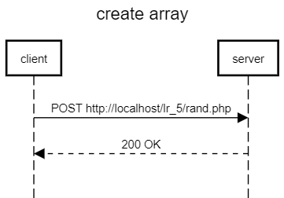
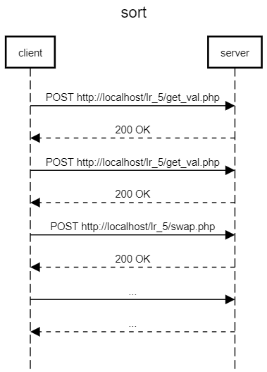
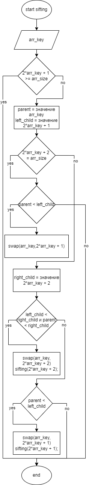

# Разработка сервисов
## Текст задания
### Цель работы
Разработать и реализовать алгоритм внешней сортировки. Данные хранятся на сервере в массиве, сервер предоставляет доступ у отдельным элементам. Клиент поочередно запрагивая отдельные ячейки сортирует массив.
## Ход работы
- Пользовательский интерфейс
- Пользовательские сценарии работы
- API сервера и хореографию
- Структура базы данных
- Алгоритмы
1) [Пользовательский интерфейс](https://www.figma.com/file/K0ytuFkRz6E7kOl94lphk5/IS_lr_5?node-id=0%3A1&t=hlb9PNjFaMZ6ZAff-1)

2) Пользовательские сценарии работы

Пользователь попадает на страницу *index.php*. При нажатии на кнопку *Генерация массива* на сервере генерируется случайный массив размером, который ввел пользователь, и записывается в бд. При нажатии на кнопку *Sort* происходит сортировка массива на клиенте, после завершения сортировки появляется сообщение *sucsess*.

3. API сервера и хореография





4. Структура БД

*channels*
| Название | Тип | Длина | NULL | Описание |
| :------: | :------: | :------: | :------: | :------: |
| **id** | INT | - | - | id элемента |
| **arr_key** | INT | - | - | ключ элемента |
| **value** | INT | - | - | значение элемента |

5. Алгоритмы

*sifting function*



6. HTTP запросы/ответы

*Запрос*

POST /lr_5/rand.php HTTP/1.1 <br>
Host: localhost <br>
Accept: text/html, */*; q=0.01 <br>
Content-Type: application/x-www-form-urlencoded; charset=UTF-8 <br>
sec-ch-ua: "Not_A Brand";v="99", "Google Chrome";v="109", "Chromium";v="109" <br>
sec-ch-ua-mobile: ?0 <br>
sec-ch-ua-platform: "Windows" <br>
User-Agent: Mozilla/5.0 (Windows NT 10.0; Win64; x64) AppleWebKit/537.36 (KHTML, like Gecko) Chrome/109.0.0.0 Safari/537.36 <br>
X-KL-Ajax-Request: Ajax_Request <br>
X-Requested-With: XMLHttpRequest <br>

*Ответ*

HTTP/1.1 200 OK <br>
Connection: Keep-Alive <br>
Content-Length: 0 <br>
Content-Type: text/html; charset=UTF-8 <br>
Date: Wed, 11 Jan 2023 21:00:15 GMT <br>
Keep-Alive: timeout=120, max=1000 <br>
Server: Apache <br>
X-Content-Type-Options: nosniff <br>

7. Значимые фрагменты кода

*Функция генерации случайных элементов*
```js
function rand(){
        arr_size = Number(prompt('Введите размер массива'));
        if (!arr_size || arr_size <= 0){
            alert('Некорректный ввод');
            return 0;
        }
        $("#create").prop("disabled", true);
        $.ajax({
            url: "rand.php",
            type: "POST",
            cache: false,
            async: false,
            data: {"size": arr_size},
            dataType: "html",
            success: function(data){
                $("#create").prop("disabled", false);
                $("#sort").prop("disabled", false);
            }
        });
    }
```
